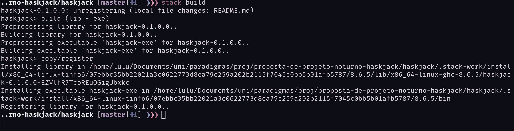
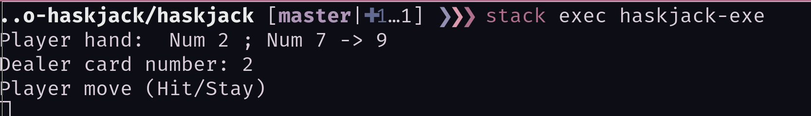
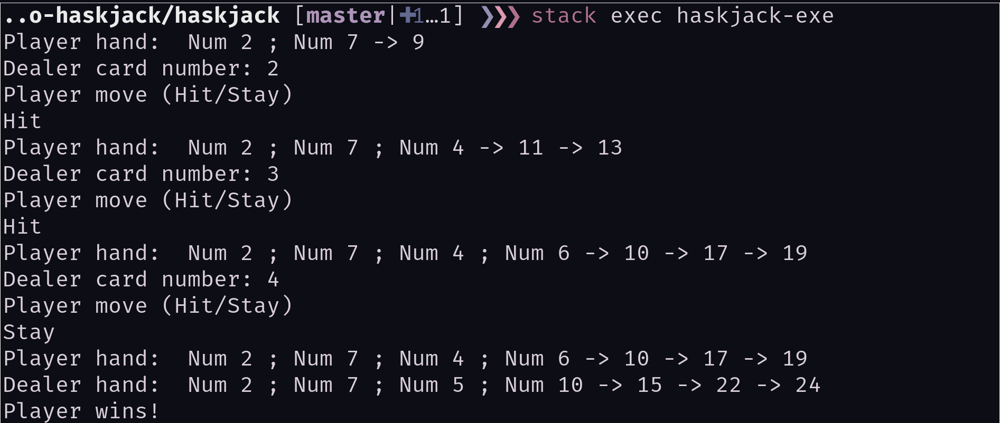

# Haskjack

Jogo desenvolvido em [Haskell](https://www.haskell.org/) para a disciplina de Paradigmas de Programação da Universidade Federal do ABC, ministrada pelo professor [Emilio Francesquini](http://professor.ufabc.edu.br/~e.francesquini/) no 2º quadrimestre de 2019.

## Objetivo

Implementação do jogo [Blackjack](https://www.blackjackinfo.com/blackjack-rules/) na linguagem Haskell.

## Instalação

Necessário instalar o [Haskell Stack](https://docs.haskellstack.org/en/stable/README/), gerenciador de projetos para Haskell.

macOS ou Linux:
```
curl -sSL https://get.haskellstack.org/ | sh
```

## Compilação e Execução

Para compilar o programa, basta entrar no diretório raíz e executar o comando: `stack build`.



Após compilado, para execução, basta utilizar o comando `stack exec haskjack-exe`



## Como jogar

O jogador possui dois comandos:
`Hit` (ou `hit`) e `Stay` (ou qualquer coisa que não seja `Hit`). Hit pega uma nova carta, enquanto Stay termina as ações do jogador e revela o valor da mão do Dealer e define o vencedor.

